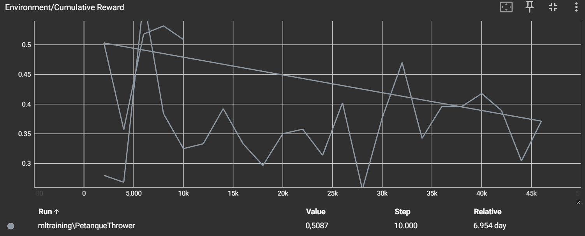
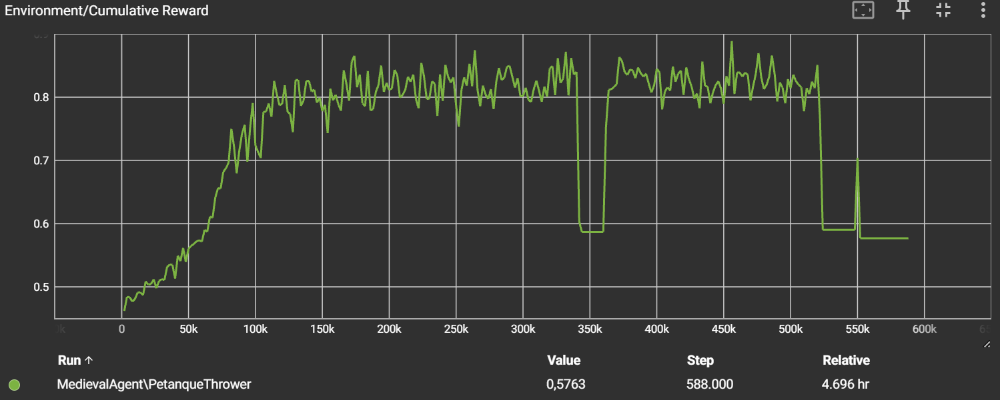

# AI-powered petanque VR-game: tutorial

## Inleiding

In dit project ontwikkelen we een virtuele petanque-game, genaamd World-Petanque, waarin je het opneemt tegen een AI-agent in een potje petanque binnen een VR-omgeving.
Na het doorlopen van deze tutorial heb je een werkende VR-petanque-game waarbij een AI-agent op basis van beloningen en observaties leert om strategisch petanque te spelen in een gesimuleerde 3D-omgeving. Je krijgt inzicht in hoe de agent is opgezet, hoe de omgeving functioneert, en hoe de training werd uitgevoerd en geëvalueerd.

---

## Methoden

### Installatie

- Unity versie: **6000.0.50f1**
- Anaconda: **64-Bit**
- ML-Agents Toolkit: **v0.30.0**
- Python: **3.8**
- PyTorch: **1.7.1**
- Protobuf: **3.20.\*'**
- TensorBoard: **2.12.0**
- Oculus Integration SDK: **v55.0**
- VR Support: OpenXR Plugin **v1.7.0**

### Verloop van het spel

- Bij het opstarten van de game komt de speler terecht in een interactieve VR-omgeving waar hij vrij kan rondlopen. Deze ruimte dient als hoofdmenu en bevat een duidelijk gemarkeerd startmenu.
- Zodra het spel begint, nemen de speler en de AI-agent om beurten een worp met als doel de boule zo dicht mogelijk bij het target te werpen. Het systeem houdt dan ook de score bij.
- Na elk drie keer om de beurt gegooid te hebben, eindigt het spel, en kun je kiezen om opnieuw te spelen.

### Observaties, acties en beloningen

#### Observaties:

- Relatieve positie van de boule ten opzichte van het target
- Snelheid van de boule
- Positie van de boule

#### Acties:

- Gooirichting bepalen
- Werpkracht bepalen
- Werpen van de boule

#### Beloningen:

- De boule valt van het terrein: -1
- Werpresultaat, afhankelijk van worp (1 = goed, 0 = slecht), afstand van boule met target (1 = dichtbij, -0.5 = ver weg): min. -0.5, max. 2
- Tijdens de boule beweegt, afhankelijk van de veranderlijke afstand tussen boule en target: min. 0.0, max. 0.0.005
- Tijdbesteding actieuitvoering: -0.001

#### Objecten:

- **Player**: Een VR-personage dat wordt bestuurd door de speler via een VR-headset en handcontrollers. Dit is gebeurd via het XR-toolkit.
- **Agent**: Visueel gameobject met een rigidbody die worpen uitvoert volgens een getrained ML-script.
- **Boule**: Metalen-lijkende bol met realistische fysica.
- **Target**: Een kleinere, anderskleurige bol dat stilstaat en dient als doelwit.
- **Petanque area**: Een verzameling van themed 3D-gameobjecten die samen een afgebakend terrein vormen.
- **Scorebord**: Een themed 3D-gameobject die duidelijk de huidige score voor de agent en speler bijhoudt.
  **Setting:**
  Onze game heet 'World Petanque' voor een reden. Het is petanquen in op verschillende niet-typische locaties, in verschillende niet-typische tijden. Dit zorgt voor een nieuwe, unieke ervaring op het standaard petanquen.

Merk op dat de agent, het scorebord én de petanque area allemaal in hetzelfde thema zijn!
**Afwijkingen**:
Wegens tijdsconstricties, hebben we helaas de andere themed-levels, niet volledig kunnen perfectioneren, waardoor deze niet in de finale build zijn.

---

## Resultaten

De eerste training ging heel onregelmatig. Het leek soms "dommer" te worden en we hebben daarom besloten wat met de belonging- en strafpunten te spelen.

Onze huidige agent maakt gebruik van dit trainingsmodel. Die hebben we laten trainen in het huidig level. Hier zie je een rustige groeiperiode, die opeens een piek naar perfectie krijgt, met heel mooie beloningswaarden van over 6. Iets wat "gelukkig" geen constante bleef, zodat de tegenspeler (bestuurd door de ML-agent) niet onverslaanbaar is.

### Waarnemingen

De training van de agent, was interessant om te zien. Het eerste model op het begin begon vaak zelf achter zichzelf te gooien.
De rest van de trainingsvooruitgang was ook visueel duidelijk te zien, door de aard van de acties. De bal die werd geworpen, was lang heel schuin gericht.
Ook de werpkracht varieërde in extremen.

---

## Conclussie

Wij hebben dus een VR-game gemaakt door een 3D-omgeving op te zetten, met het XR-toolkit geïnjecteerd, samen met een ML-trainingsmodel die een agent heeft getrained om als tegenspeler te petanquen.

De training van de agent, verliep eerst niet goed, en was heel onregelmatig. Maar na wat gespeel met de belonings- en strafpunten werd de agent langzaam beter.

Het leek erop alsof de agent zich eerst moest aanpassen om zich te situeren en vervolgens leren omgaang met de bal. Eenmaal hij dat kon, begon hij zijn "richtingsgevoel" te verbeteren. De agent slaagde er uiteindelijk in om op regelmatige basis, maar niet altijd, goede tot perfecte worpen te maken.

Als we de agent nu nog meer zouden laten trainen, zou het misschien te goed worden. Het is nog steeds een game, waar de speler de mogelijkheid moet hebben om te winnen. Hierdoor hebben we ook op een bepaald punt de training stop gezet, zodat de agent niet onoverwinnelijk wordt.
